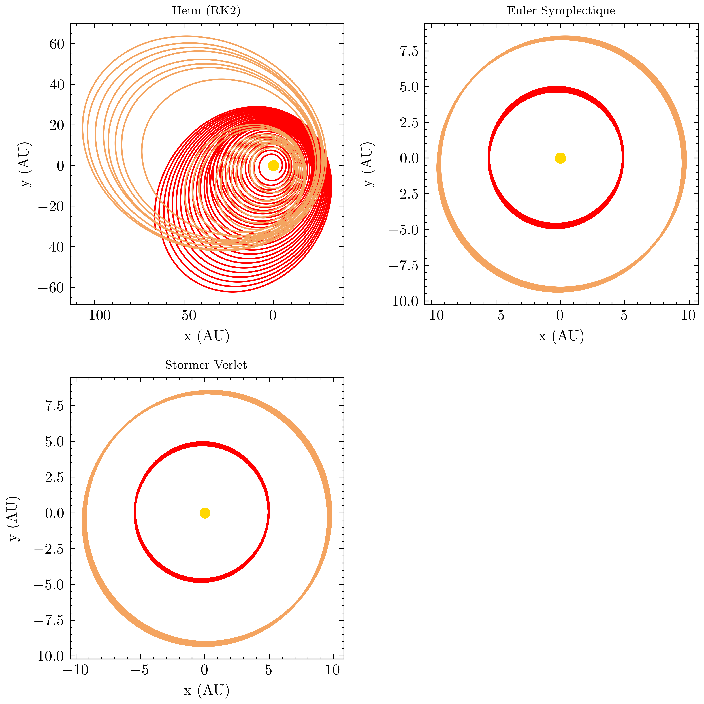

# celestial-mechanics
Simulating Jupiter and Saturn orbiting around the Sun for 5000 years.

### Installing
Clone the project
```bash
$ git clone https://github.com/Mathieu-R/celestial-mechanics
```

Create virtual environment
```bash
$ python3 -m venv <env-name>
$ source env/bin/activate # OSX / Unix
$ env\\Scripts\\activate.bat # Windows
$ python3 -m pip install --upgrade pip
```

Install required packages
```bash
$ python3 -m pip install -r requirements.txt
```

### Launch simulations    
Type `--help` command to show all the possible parameters that are available and how to launch a simulation.

```bash
$ python3 index.py --help
Usage: index.py [OPTIONS]

Options:
  -cb, --body [Sun|Jupiter|Saturn|Earth]
                                  Celestial body to simulate. You can add
                                  multiple bodies typing multiples -cb
                                  [default: Sun, Jupiter]

  -d, --dimensions INTEGER        Only for static plot. Dimensions of the
                                  orbital evolution static plot (2D / 3D)
                                  [default: 2]

  -p, --plot [static|animated]    (S)tatic or (A)nimated plot  [default:
                                  static]

  -s, --solver [heun|euler-symplectic|stormer-verlet]
                                  Only needed for animation. Type of numerical
                                  scheme. Euler symplectic and Stormer-Verlet
                                  are symplectic schemes. For static plot, all
                                  the scheme are used at once to compute 4
                                  subplots.  [default: stormer-verlet]

  -t, --time INTEGER              Time of integration (in years). You can add
                                  multiples times typing multiples -t
                                  [default: 5000]

  -sa, --save                     Save plot or animation
  --help                          Show this message and exit.
```

For example: 
```bash
$ python3 index.py -cb Sun -cb Jupiter -cb Saturn -p animated -s stormer-verlet
```

### Orbital evolution of the Sun, Jupiter and Saturn for 5000 years


